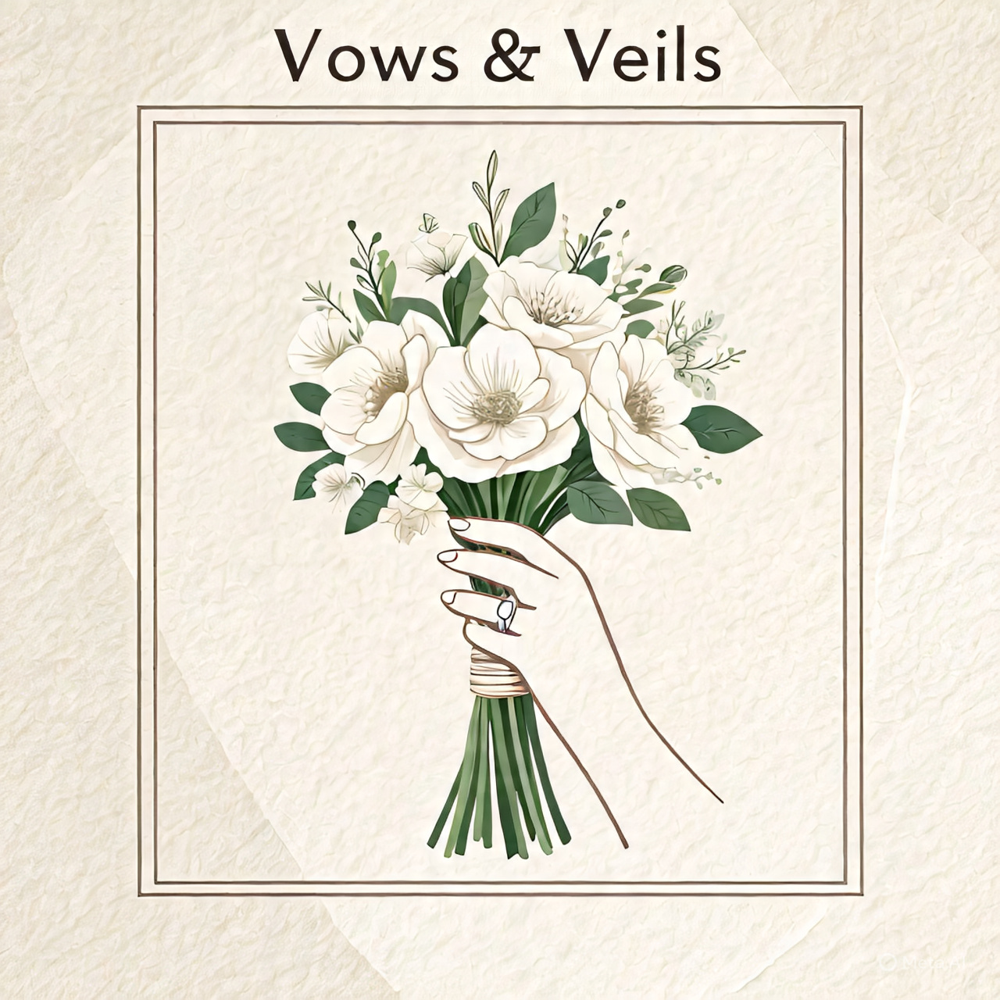
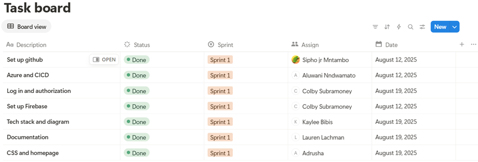
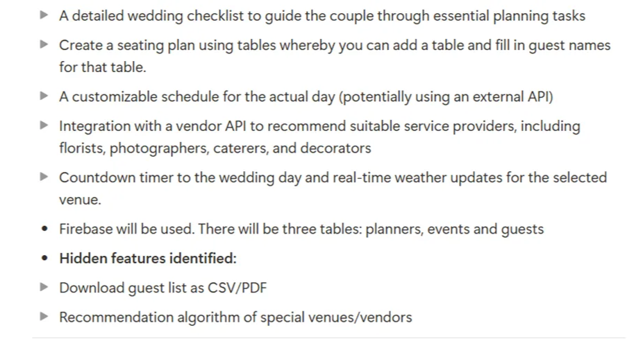
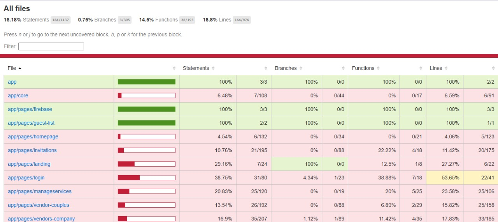

# COMS3011 - Software Design Project

# **Vows & Veils**



## (Project 3 - Event Planning)

Student numbers:

- 2430285
- 2667194
- 2671832
- 2702445
- 2538031
- 2604668

---

## Purpose:

Vows & Veils was created to allow smooth wedding planning by providing a centralized platform for both couples and their guests. Planning a wedding can be overwhelming, with many details to manage and guests to coordinate. So, we set out to build something simple, smart, and supportive. The goal is to build a simple, intuitive site where couples can effortlessly organize every aspect of their wedding day, from guest RSVPs to budgets and vendor selections, while guests can quickly confirm attendance without any unnecessary hassle. We want to provide a seamless, all-in-one experience that keeps everything in one place, helping couples stay on track with checklists, seating plans, vendor comparisons, session details and a countdown to the big day. We focus on user-friendly design and smart features like real-time weather updates, countdown timers, and a vendor recommendation system to take the stress out of wedding planning. Whether you’re a guest attending a wedding or a couple looking to plan your big day, our platform is built to support you every step of the way.

## External access links:

1. **Publicly hosted application**

        Live URL - Deployed web app (Azure): 

[https://mango-mushroom-00c4ce01e.2.azurestaticapps.net/](https://mango-mushroom-00c4ce01e.2.azurestaticapps.net/)

2. **Github Repository**
    
    Repository link: 
    
    [https://github.com/Pixel-Perfect-SDP/Vows-n-Veils?tab=readme-ov-file](https://github.com/Pixel-Perfect-SDP/Vows-n-Veils?tab=readme-ov-file)
    

---

## Work planning

We adhere to the Scrum methodology throughout the project, utilizing Notion as our primary workspace for planning and progress tracking. The structure is organized as follows:

### Scrum Board (Notion)

The board comprises our product backlog, sprint backlog, and task progress tracking. It is organized by the sprint in which each task was completed and displays the team members assigned to each task as well as deadlines for tasks.

Link: [https://www.notion.so/23c2a298f77b8092b383e89d1aeef147?v=23c2a298f77b80b08156000cb5d7c620](https://www.notion.so/23c2a298f77b8092b383e89d1aeef147?pvs=21)

### Scrum Ceremonies (Notion)

This page documents all of our Scrum ceremonies, including daily stand-ups, sprint planning, sprint retrospectives, and sprint reviews. It contains meeting notes, summaries, and key decisions made throughout the process.

Link: [https://www.notion.so/Scrum-23c2a298f77b8035a54cdb1291535c77](https://www.notion.so/Scrum-23c2a298f77b8035a54cdb1291535c77?pvs=21)

### Proof of Scrum **methodology**

Sprint 1:

We used a Notion board to track our tasks throughout the first sprint. The screenshot below shows completed tasks, demonstrating that the plan was actively used by all members of the team.



We recorded all planning meetings for Sprint 1 in Notion. The screenshot below demonstrates that the team discussed the plan for the sprint thoroughly.




Sprint 2:

We continued to use a Notion board to track our tasks throughout the second sprint. The screenshot below shows completed tasks, demonstrating that the plan was actively used by all members of the team.

We recorded all planning meetings for Sprint 2 in Notion. The screenshot below demonstrates that the team discussed the plan for the sprint thoroughly.


---

## Development Guides

### **Creating a development database:**

1. Set up a firebase project by going to the Firebase Console and creating a new project.
2. Configure the firestore database by navigating to the Firestore Database inside the project and creating a Firestore instance in test mode for development.
3. Add authentication by enabling authentication methods.
4. Get Firebase Config by navigating to the project settings and copying the Firebase SDK config object.
5. Update the angular environment by pasting the Firebase config into the Angular project’s environment files.

### **Creating a development API:**

1. Install Firebase CLI by running the following command: “npm install -g firebase-tools”.
2. Login by running firebase login and then run firebase init functions in the project folder to set up Cloud functions.
3. Develop functions locally by using “firebase emulators:start” to run functions locally for testing.
4. Deploy to firebase using the following command: “firebase deploy –only functions”.

### **Creating a development site:**

1. Clone the github repository using the following command: “git clone [https://github.com/Pixel-Perfect-SDP/Vows-n-Veils?tab=readme-ov-file](https://github.com/Pixel-Perfect-SDP/Vows-n-Veils?tab=readme-ov-file)“.
2. Install angular dependencies by navigating to the project folder and running “npm install”.
3. Configure the environment by ensuring that src/environments/[environment.ts](http://environments.ts/) contains the Firebase config for development.
4. Run locally by starting the Angular dev server using “ng serve”. In the browser, open “[http://localhost:4200](http://localost:4200/)”
5. Deploy to Azure by building the production version using “ng build –prod” and deploy the generated files to the Azure Web App.

---

## Git Methodology

Our team used Git for version control to manage and collaborate on the wedding planning platform project. By following this methodology, we maintain a clean, organized, and collaborative codebase that supports efficient teamwork and reliable delivery.

### **Branching strategy**

We follow a feature-branch workflow, where all developments for new features or enhancements will occur on dedicated branches that are separate from the main branch. This approach ensures that the main branch always contains stable, working code and allows team members to efficiently work independently.

The main branch, “main” will always contain production ready code. Feature branches, for example “feature/countdown” will be used for developing and testing new features. Each feature branch will have a clear description named according to the work being done by a member. Feature branches will be named as “feature/<name>” where <name> is the feature being worked on.

**Creating and working on a branch:**

1. Pull the latest changes from main by running the command “git pull origin main”.
2. Create a new branch for a specific task by running the command “git checkout -b feature/name” 
3. Make changes and commit frequently with clear messages.
4. Push the branch to the remote repository by running the command “git push origin feature/name”.
5. Open a pull request that targets “main” and request a team review.
6. Merge the branch into main once it has been approved.

**Workflow reference:**

[https://www.atlassian.com/git/tutorials/comparing-workflows/feature-branch-workflow](https://www.atlassian.com/git/tutorials/comparing-workflows/feature-branch-workflow)

### **Commit messages**

We follow a consistent commit message style, which helps to keep the history of the project clear and meaningful. Commit messages use present tense when describing work done and changes made, include additional details if needed, reference related issues and have a single logical change. Commits are made after each logical change and not at the end of a large task.

An example of a commit message is “Add button for product update”.

### **Collaboration and code review**

All code changes are made via Pull Requests. Team members review each Pull Request to ensure code quality and functionality before merging. We also use GitHub Issues to track bugs throughout the project. Any merge conflicts that arise throughout the project will be discussed and resolved between team members before pushing changes.

### **Tool and resources**

- Github: Repository hosting, pull requests, issue tracking
- CI/CD: Github Actions pipelines run tests on branches and pull requests to main code integrity.

---

## Technology Stack

For this project we have selected the following technology stack:

### **Frontend: Angular (with HTML, CSS, and JavaScript )**

We chose to use Angular to broaden our knowledge as web application developers and to gain experience using a framework that none of our group members had previously used.

After researching we found that Angular provides many different libraries that will be useful in simplifying the development process and enhancing the functionality of our application.

In addition to Angular:

- CSS will help greatly with the visual design and overall presentation of our web application.
- HTML is the standard language used when creating a Web App as it gives the skeleton of the web page and is an essential framework for content organization.
- JavaScript gives the basic interactivity and dynamic behavior we will need in our web app to create a responsive and engaging user experience.

### **Backened: Node.js**

We chose node.js for the backend as it is one of the most widely used backend technologies, therefore ensuring a wide variety of documentation, community support, and resources available if we run into challenges throughout the project.

[Node.js](http://node.js/) offers the advantage of being consistent in terms of the backend and the frontend, which both use JavaScript. There are also many packages available to use with Node.js via the npm or Node Package Manager, which provide access to several tools and libraries that will streamline development and enhance the functionality of our web application.

### **Database: Firebase**

We decided to use Firebase as our database for this project as many of our group members were familiar with the platform through previous projects. This prior experience allows us to work more efficiently and use existing knowledge.

Firebase also simplifies Authentication as it provides built-in functionality that ensures security. In addition Firebase offers a centralized environment for managing the projects data collections and tables in a single centralized database.

### **Hosting and Infrastructure: Microsoft Azure**

We decided to use Microsoft Azure for the hosting and infrastructure. As students at the University of the Witwatersrand we are allocated credits which we used to deploy the static web application without additional costs.

Our team also had prior experience using Azure and were easily able to link it to our GitHub repository as we had successfully implemented it before in previous projects.

---

## Project management methodology

### **Chosen Methodology: Scrum**

For this project, we have chosen to adopt the Scrum methodology, an Agile framework that is well-suited for managing complex, and evolving projects like our wedding planning platform. Scrum emphasizes iterative development, collaboration, and continuous feedback, which allows our team to maintain flexibility as the project progresses.

Scrum was selected because it allows for effective teamwork through defined roles, regular ceremonies and meetings, and sprints within a certain timeframe. This structure will allow us to break down the project into manageable tasks and adapt to changes efficiently. The frequent reviews and retrospectives ensures quality and alignment with project goals throughout the development cycle.

**Methodology references:**

- Scrum guide: [https://www.projectmanager.com/blog/guide-to-scrum-ceremonies](https://www.projectmanager.com/blog/guide-to-scrum-ceremonies)
- Agile framework: [https://www.mendix.com/agile-framework/](https://www.mendix.com/agile-framework/)

### **Tools used: Notion**

We use Notion as our primary workspace for planning and tracking tasks throughout the project. Notion allows us to centralize project artifacts and allow collaboration for organization and transparency.

Our Notion board includes a product backlog and sprint backlogs, organized by sprint cycles. Each task is assigned to team members with a status which is updated as the sprint progresses. This task tracking board allows clear visibility into workload progress.

We document all Scrum ceremonies including daily stand-ups, sprint planning, sprint reviews, and sprint retrospectives on Notion. This includes meeting notes, summaries and key decisions made, which allow us to maintain accountability and facilitate continuous improvement.

**Scrum Board (Notion):**

[https://www.notion.so/23c2a298f77b8092b383e89d1aeef147?v=23c2a298f77b80b08156000cb5d7c620](https://www.notion.so/23c2a298f77b8092b383e89d1aeef147?pvs=21)

**Scrum Ceremonies (Notion):**

[https://www.notion.so/Scrum-23c2a298f77b8035a54cdb1291535c77](https://www.notion.so/Scrum-23c2a298f77b8035a54cdb1291535c77?pvs=21).

### **Project procedure**

We plan the project in timed sprints. At the start of each sprint, we hold a sprint planning meeting in order to select backlog items to complete and assign tasks to members. Daily stand-up meetings are held to synchronize team work, discuss progress and identify obstacles that team members may be facing. Tasks are regularly tracked on the Notion task board to reflect its current status and ensure accountability. At the end of the sprint, sprint reviews and sprint retrospectives allow us to demonstrate progress, gather feedback and discuss improvements for future sprints. Git and Github are used for version control, managing feature branches and collaboration on code.

This structured approach allows us to deliver work iteratively and adapt to changes while still maintaining team alignment throughout the project.

---

## Initial design and Development plan

### **Purpose and objective**

Vows & Veils is a centralized platform that simplifies wedding planning for couples and makes RSVP management seamless for guests. Couples will be able to plan every aspect of their wedding, while guests can easily confirm attendance and provide necessary details — all without unnecessary steps or confusion.

### **Core features**

For guests:

- A dedicated RSVP page that does not require signing in.
- Input fields: Full name and surname, dietary requirements and allergies, song requests, email address and phone number, attendance confirmation (yes/no), gift registry access.
- Code entry for confirmed attendees which has been provided by the couple.
- Automated email confirmation with wedding details.

For couples:

- Secure login using Google sign-in.
- Create an event page with required fields: full names of the couple, wedding date, selected venue, gift wishlist, budget tracking, custom event URL, preferred vendors.
- A wedding checklist with essential tasks for couples to stay on track.
- Seating plan builder with table-based layout for guest assignment.
- Vendor recommendation system via an external vendor API.
- Countdown timer to the wedding day.
- Real-time weather updates for the venue.

### **Technical approach**

**Frontend:**

The frontend must be responsive and user friendly. It will have separate interfaces for guests and couples. It will include a guest manager which will allow couples to view RSVPs and invite guests as well as a vendor dashboard which will allow vendors to be added and to track costs.

**Backend and Database:**

Firebase will be used for authentication and real-time data. There will be database components for guests, vendors, events and files. External APIs will be used for vendors and event metadata.

API’s and integrations:

- GuestList API - Add, update, and retrieve guest details and RSVP status.
- Vendor API– Manage venues, catering, and other services
- EventData API– Event metadata
- Export API– Provide downloadable event packages for other apps

### **Development roadmap**

The goal of the development roadmap is to outline a clear, step-by-step approach for building the wedding planning platform from initial setup to final launch. It breaks the project into manageable phases within our sprints, ensuring that core features are developed first, followed by enhanced features and functionality. This structured approach helps maintain focus, and ensure that each goal delivers value, leading to a user-friendly platform that meets the needs of both couples and guests.

| Phase | Goals | Deliverables |
| --- | --- | --- |
| 1 - Core structure | • Firebase setup
• Github setup
• Azure deployment
• Google sign-in and homepage UI | Working sign in which leads to an event creation page. |
| 2 - Event creation | • Create an event page
• Wedding checklist
• Seating plan tool | Couples can create and manage an event. |
| 3 - Enhanced features | • Countdown timer
• Real-time weather API
• Vendor API integration | Fully functional planning tools |
| 4 - Advanced tools | • Guest list export as a PDF/CSV
• AI recommendation engine | Advanced features added to product. |
| 5 - Testing | • Bug fixes
• UI polish | Most features completed. |
| 6 - Launching | • Final touches | The platform is ready to launch. |

### Wireframes and Mockups

Login page:


Landing page:


Couples homepage:


Venues for couples page:


Vendors for couples page:


Invitations page:


Guest list page:


RSVP page:

Vendor companies dashboard:


Venue companies dashboard:


---

## Design documents

### Sprint 1:

**Deployment diagram:**


### Sprint 2:

Component diagram:

Use case diagram:

Class diagram:

Sequence diagrams:

**Sequence Diagrams**

Vendor-company page→ Updating the order status


Vendor-couples page → ordering vendors


Invitations page → Page load(with only events and venues on invitation)


Invitations page → Template Selection and Change of Template


---

## User stories and their accompanying user acceptance cases

### **Sprint 1:**

1. As a user who wants to plan their wedding, I am able to see short summaries of options available on the landing page so that I can quickly understand what services are offered and decide where to start.
    
    **User Acceptance Tests:**
    
    - Given I am a visitor on the website, when the landing page loads, then I should be able to see available wedding planning options.
    - Given I am on the landing page and it has loaded, when the options are displayed, then each option should include a short summary describing the service.
    - Given the planning options and their accompanying summary has loaded and is displayed on the landing page, when I read them, then the text should be legible and easy to understand.

1. As a user who wants to plan my wedding, when I click the "Go to Login" button, a new page should load that shows a Google Sign-In button so that I can log in quickly using my Google account.
    
    **User Acceptance Tests:**
    
    - Given I am on the landing page, when I click the “Go to Login” button, then a new page will load without errors.
    - Given the Google Sign-In button is visible, when I click it, then I should be directed to the Google authentication page.
    

### Sprint 2:

1. As a user looking to plan my wedding, I want to be redirected to the homepage when I sign in for the first time, so that I can create my wedding by inputting required details such as names, date, and time.

**User Acceptance Tests:**

- Given I am a new user, when I sign up and am successfully authenticated, then I should be redirected to the homepage.
- Given that I have successfully signed in and am on the homepage, when it is my first time signing in, then I will see a form displayed allowing me to enter my wedding details, such as names, and wedding date and time.
- Given I am a user who is creating my wedding, when I am filling out the wedding details form and a required input field is not completed, then the submit button will be disabled, preventing me from submitting my details.
- Given I am a user who is creating my wedding, when I have filled out the wedding details form and all input fields are valid, then the submit button will be enabled, allowing me to confirm my details.

1. As a user who has successfully created their wedding event, I want to be redirected to the homepage when I sign in, so that I can see a personalized welcome message and a sidebar that allows me to navigate to other pages.

**User Acceptance Tests:**

- Given that I have already created my wedding event, when I sign in, then I am redirected to the homepage.
- Given I am on the homepage after signing in and have already created my wedding event, when the dashboard loads, then a sidebar is displayed with links to other pages, such as guest list, invitations, vendors, and venues.
- Given I am on the homepage and have already created an event, when the pages loads, then I will see a welcome message that includes mine and my partner’s names.
- Given I am on the homepage and see the links on the sidebar, when I click on a link, then I am navigated to the corresponding page without errors.

1. As a couple looking to choose a wedding venue, I want to click on the “Venues” link in the sidebar so that I am redirected to a page displaying the different venue options available to me.

**User Acceptance Tests:**

- Given I am signed in and am on the homepage, when I click the “Venues” link on the sidebar, then I will be successfully redirected to the venues page with no errors.
- Given I am on the venues page, when the page loads, then I will see a list of available venues with their address, venue capacity, and a button to show more details about the venue.
- Given I am on the venues page, when I scroll through the list of available venue options, then all venues are displayed in a clear layout that is easy to understand.

1. As a couple browsing venues on the venues page, I want to click a button to see more details about a particular venue, so that I can view the venue’s details in a clear format and choose that venue as my wedding venue.

**User Acceptance Tests:**

- Given I am on the venues page, when I click the “View venue” button for a specific venue, then I am shown the full details of that venue in a logical, organized format.
- Given I am viewing a venue’s details, when I review the information, then I can see all relevant information such as name, location, capacity, price, images, and contact details for the venue company.
- Given I have selected a venue, when I return to the venues page, then the selected venue is shown in a seperated section.
- Given I am on the venues page, when I navigate back to the venues list or to the homepage, then the navigation works correctly without errors and my venue selection is retained.

1. As a couple looking to design our wedding invitation, I want to click the “Invitations” link in the sidebar on the homepage, so that I am redirected to an invitations page where I can view templates and fill in details for my wedding.

**User Acceptance Tests:**

- Given I am signed in and on the homepage, when I click the "Invitations" link on the sidebar, then I am redirected to the invitations page successfully with no errors.
- Given I am on the invitations page, when the page loads, then I can see a variety of invitation templates displayed clearly.
- Given I am viewing the invitation templates, when I click on a template, then I can open it to fill in my wedding details, such as adding a message or photograph.
- Given I have selected an invitation template, when I click the “Change template” button, then I will be shown all available templates and am able to change my choice of template.

1. As a couple looking to design an invitation template, I want to click the "Download Invitation" button, so that my invitation will download as a .png file.

**User Acceptance Tests:**

- Given I am on the invitation design page with my completed invitation, when I click the "Download Invitation" button, then the invitation downloads to my device as a .png file.
- Given I have downloaded the invitation, when I open the .png file, then the design, text, and images appear exactly as they were in the editor.
- Given I am on the invitation design page, when I click "Download Invitation," then the download completes without errors or interruptions.

1. As a person with a company for vendors or venues, I want to click the "Companies" button on the landing page, so that a popup opens allowing me to select my role.

**User Acceptance Tests:**

- Given I am on the landing page, when I click the "Companies" button, then a popup appears prompting me to select my role.
- Given the popup is displayed, when I view it, then I can see options to select either "Vendor company" or "Venue company" clearly.
- Given the popup is open, when I click the "X" button, then the popup closes without selecting a role.

1. As a company on the landing page with the companies pop-up open, I want to click the “Venue company” or the “Vendor company” button on the "Companies" popup, so that a Google sign-in prompt appears and I can authenticate my account.

**User Acceptance Tests:**

- Given I am on the landing page and the "Companies" popup is open, when I click the button for "Venue Company," then a Google sign-in prompt appears.
- Given I am on the landing page and the "Companies" popup is open, when I click the button for "Vendor Company," then a Google sign-in prompt appears.
- Given the Google sign-in prompt is displayed, when I enter valid Google credentials, then I am successfully authenticated and redirected to the respestive company page.

1. As a company that hasn’t created an account on the site yet, I want to sign in using Google, so that I am shown a form to create my company by entering the company name, email, and phone number.

**User Acceptance Tests:**

- Given I have signed in using Google and do not have an existing company account, when I complete the sign-in, then I am redirected to a company creation form.
- Given I am on the company creation form, when the form loads, then I can see input fields for company name, email, and phone number.
- Given I am on the company creation form, when I fill in all required fields with valid data and submit, then my company account is successfully created and added to the database.
- Given I have not filled in all required fields on the company creation form, when I hover over the “submit” button, it is disabled and I cannot create my company.

1. As a company that has already created an account successfully on the site, I want to sign in using Google, so that I am redirected to the respective company dashboard and can see my company name displayed at the top.

**User Acceptance Tests:**

- Given I have an existing venue company account, when I sign in using Google, then I am redirected to the venue company dashboard.
- Given I have an existing vendor company account, when I sign in using Google, then I am redirected to the vendor company dashboard.
- Given I am on the dashboard, when the page loads, then my company name is displayed clearly at the top of the dashboard.
- Given I am signed in, when I log out and sign in again using Google, then I am redirected again to the dashboard with my company name displayed.

1. As a vendor company on the vendor dashboard, I want to add a new service to my company profile by clicking the “Add service” button, so that a form appears for me to fill in the service details.

**User Acceptance Tests:**

- Given I am signed in as a vendor company, when I am on the vendor dashboard, then I can see an "Add Service" button clearly displayed.
- Given I am on the vendor dashboard, when I click the "Add Service" button, then a form appears prompting me to enter service details.
- Given the form is displayed, when I view it, then I see input fields for details such as service name, description, price, type, capacity, and booking notes.
- Given I am filling in the form, when I enter valid data and click "Save", then the service is added successfully to my company’s list of services.
- Given I have successfully added a service, when I return to the vendor dashboard, then I can see the newly added service in my list.

1. As a vendor company, I want to view all orders for my services on the vendor dashboard, so that I can see the requested service and event details and update the order status.

**User Acceptance Test:**

- Given I am signed in as a vendor company, when I open the vendor dashboard, then I can see a list of all orders placed for my services.
- Given the orders list is displayed, when I view it, then I can see details for each order, including which of my services was requested, the couple’s event details, and the order status.
- Given I am viewing an order, when I update the order status, then the new status is saved and reflected in the order list.
- Given I am on the vendor dashboard, when I refresh or log back in, then all order details and statuses are saved and displayed correctly.

1. As a couple on the homepage, I want to click the "Vendors" button on the sidebar, so that I am redirected to the vendors page.

**User Acceptance Tests:**

- Given I am signed in and on the homepage, when I click the "Vendors" button on the sidebar, then I am redirected to the vendors page with no errors.
- Given I am on the vendors page, when I navigate back to the homepage or other sections using the sidebar, then navigation works correctly.
- Given I am on the vendors page, when I click the “See vendors” button, then all vendor service options are displayed clearly in a responsive layout.

1. As a couple, I want to click the "Order" button on a vendor’s page, so that a form appears where I can input my wedding details and request the service from the vendor.

**User Acceptance Tests:**

- Given I am on a vendor’s page, when I see the "Order" button, then I can click it to request a service.
- Given I click the "Order" button, when the form loads, then I can see input fields for wedding details such as wedding date, time, number of guests, and any special requests.
- Given the order form is displayed, when I fill in all required fields with valid information and submit, then my request is sent successfully to the vendor.

1. As a couple, I want to click the "Check My Orders" button on the vendors page, so that I can see all my vendor orders, including the company name, category, price, order status, and the details I filled in on the order form.

**User Acceptance Tests:**

- Given I am on the vendors page, when the page loads, then I can see a "Check My Orders" button clearly displayed.
- Given I am on the vendors page, when I click the "Check My Orders" button, then I am shown a list of all vendor service orders I have made.
- Given my vendor orders are displayed, when I view the list, then each order includes company name, category, price, order status, and the details I filled in from the order form
- Given I have multiple vendor orders, when I view them, then they are displayed in a structured, readable layout

1. As a venue company on the venue dashboard, I want to add a new venue to my company profile so that the venue is  shown on the website and made available for clients to choose.

**User Acceptance Tests:**

- Given I am logged in as a venue company and am on the venue dashboard, when I click the “Add venue” button, then a form will appear for me to enter the venue details.
- Given I fill out all required fields with valid information, when I click “Submit” button, then the new venue will be added to my company profile and displayed on the venue dashboard.
- Given I have filled out all required fields with appropriate information, when I click the “Submit” button, then I will see a confirmation message.

1. As a venue company on the venue dashboard, I want to delete a venue from my company profile, so that outdated or unavailable venues are removed from the website and cannot be selected by couples.

**User Acceptance Tests:**

- Given I am logged in as a venue company and am on the venue dashboard, when I click the “Delete venue” button next to a venue, then a comfirmation prompt will appear asking me to confirm my deletion.
- Given I confirm the deletion, when the system processes the request, then the venue will be removed from my company profile and will no longer be shown to couples.
- Given I click the “Delete venue” button, when the confirmation prompt appears and I click “Cancel”, then the venue will remain on the dasboard.

1. As a user planning their wedding and am on the homepage, I want to click the “Guest List” link on the homepage, so that I am redirected to the Guest List page to begin planning and managing my wedding guests.

**User Acceptance Tests:**

- Given I am on the homepage, when I click the “Guest Link” link on the sidebar, then I will be redirected to the Guest List page with no errors.
- Given I am redirected to the Guest List page, when the page loads, then all page elements are displayed in a neat, and logical format.

1. As a couple planning our wedding and we are on the Guest List page, I want to filter my guest list by dietary requirements, allergies, and RSVP status so that I can easily manage guests and identify specific needs or responses.

**User Acceptance Tests:**

- Given I am on the guest list page, when I select a dietary requirement, then only guests matching that dietary requirement will be displayed.
- Given I am on the guest list page, when I select an allergy filter, then only guests with that allergy will be displayed.
- Given I am on the guest list page, when I select an RSVP status filter, then only guests with that RSVP status will be displayed.

---

## API Integration

### External API

our project uses an external api - explain the weather one

### Exposing our API

our project exposes its own api = explain the backend frontend http thing

**VenueAPI:**

Link: [https://site--vowsandveils--5dl8fyl4jyqm.code.run](https://site--vowsandveils--5dl8fyl4jyqm.code.run/venues)

API documentation**:**[https://site--vowsandveils--5dl8fyl4jyqm.code.run/api-docs/](https://site--vowsandveils--5dl8fyl4jyqm.code.run/api-docs/)

---

## User Feedback

To gather user feedback, we designed a structured feedback form covering usability, design, features, issues and overall experience. The form was distributed to users with the following questions:

1. Rate your overall experience of our website.
2. Is the website intuitive and easy to use?
3. How would you rate the visual appearance of our website?
4. What features did you like the most?
5. Did you find any features difficult to use? If yes, which ones? 
6. Were there any features missing that you would like to see? If yes, which ones?
7. Did you notice any issues? If so, what were they?
8. Do you have any final suggestions or comments?
9. Would you recommend our site to others or use our site again?

### Results

**Discussion of results**

### Integration of feedback

---

## Bug Tracker

Our project uses Github Issues as the bug tracking tool. Github Issues allows us to log bugs, assign them to team members, prioritize tasks, and track progress directly within our project repository. This ensures that all bugs are documented and visible to the whole team in order to be resolved. 

### Bug reporting

When a bug is discovered in the project, a new Issue is created in the repository with the following details:

- Title: A short clear description of the bug.
- Description: A detailed explanation of the bug including the expected vs actual behaviour.
- Labels: Used to identify if it is backend or frontend.
- Assignee: The team member responsible for fixing the bug.

### Workflow

We follow a standard Github Issues workflow whereby bugs are,

- Open: The bug has been reported.
- Assigned: A team member has been assigned to fix the bug.
- In progress: Work is going on to fix the bug.
- Closed: The bug has been fixed, tested, and merged.

### Activity and communication

- **Number of Issues:** Over 5 bugs were logged in Github Issues during the project. Each issue was updated regularly until resolution, ensuring progress was visible to the whole team.
- **Team Communication:** Team members discussed bug causes, suggested solutions, and confirmed fixes in project meetings. Additionally, commits were linked to corresponding issues to show which changes addressed each bug.

### Proof

The screenshot below shows that our team actively used Github Issues to track bugs throughout the project. It shows that all issues were logged, assigned, and closed during development. 

---

## Database documentation

For this project, it was decided to use Firebase Firestore as our database. 

### Database schema

Our database schema defines how our data is structured, stored, and accessed within the application. The database schema is designed to support the core functionality of the application by organizing data into collections and documents in Firestore. Each collection groups related data, while documents store individual records with fields and types

- **Admins, Companies, Venues/Vendors:** Manage user accounts and company listings.
- **Events and Orders:** Enable couples to create events and select venues/vendors, linking all relevant information.
- **Guests:** Store RSVP responses, dietary requirements, and song requests, which drive interactive features like guest lists and dashboards.
- **Real-time updates:** Firestore ensures that any changes made by admins, vendors, or users are immediately reflected across the app, keeping data consistent and interactive.


| Collection | Description | Documents |
| --- | --- | --- |
| Admins | Store the email address of all admin users. | • email → email address of admin user |
| CompaniesVenues | Store the information about all companies that have venues available on the website. | • companyName → name of the company
• email → email address of the company to be used when contacting.
• phoneNumber → phone number of the company to be used when contacting.
• type → the type of company is venue.
• userID → the userID of the person making the company. |
| CompaniesVendors | Store the information about all companies that have vendor services available on the website. | • companyName → name of the company
• email → email address of the company to be used when contacting.
• phoneNumber → phone number of the company to be used when contacting.
• type → the type of company is vendor.
• userID → the userID of the person making the company. |
| Venues | Store all available venues that companies have added and that couples can choose from. | • address → the physical address of the location.
• capacity → maximum number of guests the venue can have
• companyID → the companyID of the company owning the venue.
• description → a short description of the venue
• price → the price of the venue
• venueName → name of the venue
• status → status as changed by admin |
| Vendors | Store all available vendor services that companies have added and that couples can choose from. | • bookingNotes → notes that couples must be aware of when booking the vendor service
• capacity → the maximum number of guests the vendor service can provide for
• companyID → the companyID of the company owning the vendor service
• description → a description of the vendor service
• price → the price of the vendor service
• serviceName → name of the vendor service
• status → status as changed by the admin
• type → category of vendor service |
| Orders | Store the information of the couples selected venue and vendor services. | • customerID → the userID of the customer making the selections.
• guestsNum → the number of guests booked for
• vendorID → the id of the chosen vendor service.
• venueID → the id the chosen venue
• vendorStatus → status as changed by vendorCompany
• venueStatus → status as changed by venueCompany |
| Guests | Store the information about guests who have completed the RSVP form. | • allergies → allergies that the guest may have
• dietary → dietary requirements that the guest may have
• email → email address of the guest
• eventID → the eventID that the guest is completing a RSVP form for
• name → name of the guest
• RSVPstatus → indicating if the guest is attending or not
• song → song request made by the guest |
| Events | Store the wedding details as chosen and decided by the couple. | • date_time → date and time of the   wedding. 
• name1 → name of the first      partner.
• name2 → name of the second   partner. 
• RSVPcode → guests use this to   RSVP to a couples wedding. •eventID→ the userID of the person creating the event 
•vendorID → the id of the chosen vendor service for the wedding. •venueID → the id of the chosen venue service for the wedding. |

### Justification and reasoning

**Scalability:**

Firestore is a scalable, fully managed, and cloud-hosted database that automatically adjusts to accomodate an increasing number of users and data volume. Firestore adjusts storage and provisions resources automatically, which eliminates the need for manual management by team members. This ensures performance remains consistent, even during high traffic periods. This is important for our web application to ensure that the project is able to handle growth without requiring manual adjustments.

**Real-time updates:**

Firestore offers real-time synchronization of data across all connected clients. When a document is uploaded, updated, or deleted, all users will be able to see the changes instantly without the need to refresh their application. This ensures that interactive features, such as a live dashboard for our guests RSVP is up-to-date at all times. 

**Security:**

Firestore includes built-in authentication and security rules that control who has access to data to be able to read or write. We are able to ensure secure access policies for different parts of the database by linking data access to user identity and user roles. This reduced the risk of unauthorized access to data, and ensures confidentiality and integrity of user data.

**Cloud-hosted:**

Firestore removes the need to manage physical servers or storage devices as it is fully cloud-hosted. This allows our team to fully focus on the web application and user experience rather than on infrastructure management. Cloud hosting also provides automatic backup and high availability which reduces the risk of data loss. 

### Proof of deployment

The database was deployed on Firebase Firestore and connected to the Angular frontend, allowing the application to read and write data in real time. Screenshots from the Firebase console show: collections and documents populated with data, configured security rules, and activity that demonstrates the database is actively supporting the application.

**Collections and Documents:** 

All collections are populated with sample and real project data, demonstrating that the database structure matches the documented schema.


**Security Rules:** 

Access rules are configured to ensure that only authorized users can read or write specific data.


**Active Use:** 

Updates to documents in Firestore correspond to actions in the application, such as creating events, adding venues, or submitting RSVP responses, showing that the database is actively supporting the application in real time.


---

## Third-party code documentation

THE EXTERNAL API WE USE EXPLAIN HERE TOO AND WHY IT IS IMPORTANT. WHY IT WAS CHOSEN. WHAT IS CRITICAL FOR PROJECT FUNCTIONALITY

### Firebase Authentication

We use Firebase Authentication to handle secure Google sign-ins for both couples and company accounts (vendors and venues). This allows users to log in safely without managing passwords in our system, and it provides a reliable authentication flow that integrates with our Firebase backend.

**Usage in our project:**

- Couples: Sign in to access the homepage and begin planning their wedding. Once they have signed in, they can access features such as venue selection, vendor selection, invitation creation, and guest management.
- Companies (vendors and venues): Sign in to create or access company accounts and dashboards. Once they have signed in, they can access features such as adding or deleting services from their company.

**The process:**

1. When a user clicks a Google sign-in button, Firebase Authentiction triggers a Google OAuth flow.
2. Firebase validates the user credentials and returns a secure token.
3. The application checks if the user already exists within the database:
- If the user does not exist in the database, they are prompted to create a company account or their wedding event for couples.
- If the user does exist in the database, they are redirected to the appropriate dashboard based on their role.
1. The authentication state is maintained in the client application to manage user sessions.

**Reasoning and choice:**

- Provides secure and trusted authentication without managing passwords manually.
- Supports multiple authentication providers for future flexibility. We currently use Google.
- Integrates seamlessly with our Firebase Firestore database to store user and company data.
- Simplifies session management and reduces the risk of security vulnerabilities.

**References:**

https://firebase.google.com/docs/auth/web/google-signin

---

## Testing

### Automated testing

We used automated testing tools to ensure the correctness of our application code. 

**Unit Testing**

- Conducted using the Karma test runner.
- Focused on testing individual components, services, and utility functions.
- Examples of unit tests include:
    - Form validation for RSVP submissions.
    - Event creation logic to ensure correct data is stored in the database.
    - Vendor and venue listing components to verify correct rendering and data binding.

Running unit tests:

To execute unit tests with the Karma test runner, run the following command in the project directory:

```jsx
ng test
```

This will run all unit tests and display results in the console or browser. Unit tests cover important components, such as form validation, event creation, and data handling.

**End-to-end testing**

- Simulates user actions in the application to verify that features work as intended in real-world scenarios.
- Examples of E2E tests:
    - User registering for an event and submitting RSVPs.
    - Admin adding a new venue or vendor and checking visibility on the site.
    - Couples selecting vendors and verifying order information is saved correctly.

Running end-to-end tests:

For end-to-end testing, run:

```jsx
ng e2e
```

Angular CLI does not include an E2E testing framework by default, so we can configure one. E2E tests simulate user actions, such as navigating the site, creating events, and submitting RSVPs.

**Code coverage**

Code coverage was monitored using Codecov, which shows the percentage of code covered by automated tests. This helps identify untested parts of the application and ensures that new changes do not break existing functionality.



### User testing and feedback

User testing complements automated testing by evaluating usability, user experience, and interface design. A formal process was followed to ensure systematic collection and use of feedback.

**Feedback collection**

1. **Design:** A structured feedback form was created with questions covering usability, intuitiveness, visual design, features, issues, and overall satisfaction.
2. **Distribution:** The form was distributed to a sample group of users representing the target audience.
3. **Recording:** Responses were systematically collected via Google Forms. 

**Results of the feedback form**

RESULTS OF FORM and discuss little

**Integration of feedback**

- Feedback is analyzed to identify usability issues and potential improvements.
- Planned changes will be implemented in the code and reflected in automated tests (unit and E2E).
- This creates a continuous feedback loop, ensuring that user input directly informs development, testing, and refinement of the website.

WEATHER API

### Using the tests

- Run ng test for unit tests and ng e2e for end-to-end tests.
- Refer to Codecov reports to identify areas that require additional test coverage.
- After user feedback is collected, tests are updated to ensure issues identified by users are addressed.

---
